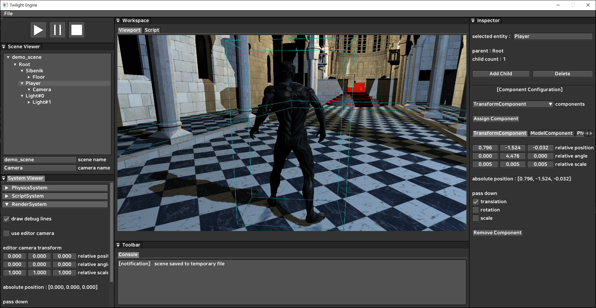
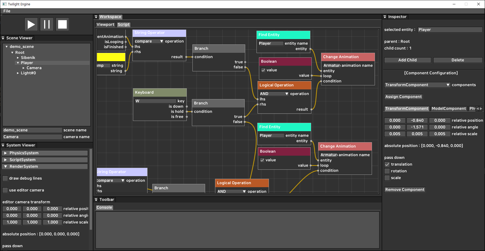
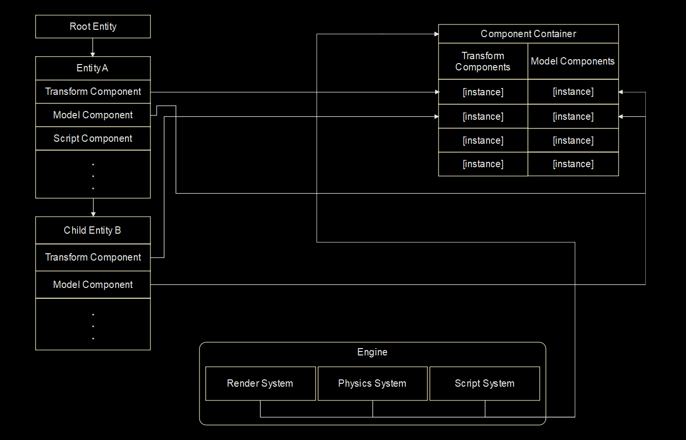

# DX11Engine

## Contents

* [About](#about)
* [Features](#features)
* [Overview](#diagram)
* [Problems](#problems)
* [License](#license)

## <a name=about>About

This is C++ game engine using Direct3D 11 made for study purpose.

Demo : https://youtu.be/diQm5AByzn4

### <a name=features>Features

* Framework
  * Entity-Component-System architecture
  * Node script for entity specific behavior
  
  
* Rendering
  * Basic Phong lighting
  * Deferred Rendering
  * Cubemap shadow
  * Skybox
 
  
* Physics
  * SAT collision detection
  * Linear projection
  
  
* GUI
  * Editor GUI using ImGui
  * Node script using ImNodes
  
  
* Misc
  * Resource management using smart pointers
  * JSON based file management
  * Image loading using stb_image
  * Mesh loading using assimp
  
## <a name=diagram>Overview

	
## <a name=license>License

This project is under the MIT license.
